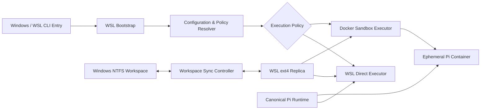

# Pix

**面向 Pi Coding Agent 的 WSL2 运行编排与容器沙箱工具**

`AI Infra / Developer Tool / CLI`

**Node.js / WSL2 / Docker Desktop / Mutagen / rsync / Pi Coding Agent**

## PROJECT OVERVIEW

Pix 是一个通过 NPM 分发的 Windows CLI 工具，用于将 Pi Coding Agent 的运行环境从宿主系统中解耦，并统一编排 Windows、WSL2 与 Docker Desktop 之间的执行链路。

项目针对 Pi Agent 原生运行方式中隔离边界有限、容器启动流程分散、Windows 文件系统性能较差以及不同运行环境状态不一致等问题，建立了一条标准化执行路径：

```text
Windows CLI
    ↓
WSL2 Runtime
    ↓
WSL ext4 Workspace
    ↓
Direct Pi / Docker Sandbox
```

开发者只需要在当前项目目录中执行 `pix`，工具便会自动完成 WSL 环境切换、工作目录映射、Runtime 注入、工作区同步以及 Pi Agent 启动。

## DESIGN MOTIVATION

Pi Coding Agent 通常需要读取项目文件、执行命令、安装依赖并修改代码。直接在 Windows 宿主环境运行 Agent，会使 Agent 获得较大的本地文件与进程访问范围；直接将 NTFS 项目目录挂载进 Docker，则会引入明显的小文件读写延迟。

Pix 将问题拆分为三个相互独立的部分：

* **宿主入口**：保留 Windows 下的低成本调用体验。
* **高性能工作区**：将项目投影到 WSL ext4 文件系统，避免 Agent 直接在 NTFS 上进行密集文件操作。
* **可控执行环境**：根据项目策略选择 WSL 直接执行或 Docker 容器执行。

这种设计使运行性能、环境一致性与隔离强度可以分别配置，而不再绑定于单一执行方式。

## TECHNICAL PATH

### 01. Windows-to-WSL Bootstrap

Pix 可以从 PowerShell、CMD 或 WSL 中启动。

当检测到命令运行在 Windows 环境时，CLI 会：

1. 识别目标 WSL2 Distribution。
2. 将 Windows 当前目录转换为对应的 WSL 路径。
3. 通过 `wsl.exe` 在目标 Linux 环境中重新启动 Pix。
4. 保留用户传入的 Pi 参数与当前工作目录。

由此，Windows 只承担命令入口职责，实际运行逻辑统一发生在 Linux 环境中。

### 02. Workspace Projection

当项目位于 Windows NTFS 分区时，Pix 不会直接将 `/mnt/c` 或 `/mnt/d` 下的目录作为 Agent 的主要工作区。

系统根据源目录生成稳定的路径标识，并在 WSL ext4 文件系统中创建对应副本：

```text
/mnt/d/projects/example
        ↓
~/.pix/workspaces/example-a1b2c3d4
```

Pi Agent 和 Docker 容器均基于该 ext4 副本运行，从而减少 NTFS、WSL 与 Docker 文件系统边界之间的高频跨层访问。

### 03. Mutagen Continuous Sync

为解决 Windows 编辑器与 WSL 工作副本之间的实时同步问题，Pix 使用 Mutagen 建立持续的双向同步会话。

```text
Windows NTFS Source
        ⇄
WSL ext4 Replica
```

启动阶段首先使用 `rsync` 或 `cp` 初始化 WSL 副本，再由 Mutagen 接管增量同步。默认同步策略将 WSL 副本作为主要执行工作区，使 Agent 获得 Linux 原生文件系统性能，同时让 Windows 侧编辑器能够实时看到 Agent 产生的修改。

同步会话支持：

* 双向安全同步
* 冲突自动决议
* 单向复制
* 会话暂停、保留或终止
* 项目级排除规则

当 Mutagen 不存在或启动失败时，系统会自动退化为基于 `rsync` 或 `cp` 的单次工作区投影，避免同步组件故障阻断 Agent 启动。

### 04. Canonical Pi Runtime

Pix 在 WSL 文件系统中维护唯一的 Pi Runtime：

```text
~/.pix/runtime/agent
```

该目录用于持久化：

* 模型与 Provider 配置
* Authentication 信息
* Agent Sessions
* Prompts、Skills 与 Themes
* Extensions 配置

WSL Direct 模式和 Docker Sandbox 模式均通过 `PI_CODING_AGENT_DIR` 指向同一 Runtime，并在容器中保持相同的绝对路径。

这种设计避免了宿主 Pi、WSL Pi 与容器 Pi 分别维护配置和会话的问题，使执行环境可以切换，而 Agent 状态保持连续。

### 05. Dual Execution Policy

Pix 提供两种运行策略。

#### Direct Mode

直接在 WSL2 中运行 Pi Agent。

适用于可信项目和高频开发场景，具有较低启动开销，并直接使用 WSL ext4 工作区与统一 Runtime。

#### Sandbox Mode

通过 Docker Desktop 在临时容器中运行 Pi Agent。

容器启动时：

* 将 WSL 工作区挂载到 `/workspace`
* 将统一 Pi Runtime 挂载到容器内相同路径
* 设置容器工作目录
* 按白名单注入 API Key 与代理环境变量
* 根据配置设置网络模式
* 支持只读或读写工作区
* Agent 退出后自动销毁容器

项目可以在 `.pix.json` 中声明默认执行策略，使不同代码库拥有不同的隔离级别。

例如，对不可信项目可以关闭容器网络：

```json
{
  "execution": "sandbox",
  "container": {
    "network": "none",
    "workspaceAccess": "read-write"
  }
}
```

### 06. Configuration and Diagnostics

Pix 使用分层配置模型：

```text
CLI Flags
    ↓
Project .pix.json
    ↓
User ~/.pixrc.json
    ↓
Built-in Defaults
```

项目同时提供环境诊断与迁移命令：

* `pix status`：展示执行策略、WSL Distribution、工作区类型、Runtime 路径以及 Pi 和 Docker 状态。
* `pix doctor`：诊断 WSL、Docker、NTFS 路径、镜像、挂载和版本一致性问题。
* `pix migrate`：将旧 Windows Pi Runtime 迁移到 WSL。
* `pix install-shell-env`：让 WSL 中直接执行的 `pi` 与 Pix 共用同一 Runtime。
* `pix --dry-run`：输出最终执行命令，便于调试启动链路。

## ARCHITECTURE



## MODULE DESIGN

### HOST BRIDGE

负责 Windows 与 WSL2 之间的环境检测、路径转换和进程重启，将跨平台差异收敛到统一的 Linux 执行入口。

### WORKSPACE CONTROLLER

负责识别 NTFS 工作区、创建稳定的 ext4 投影路径、初始化项目副本以及管理 Mutagen 同步会话。

### RUNTIME MANAGER

维护唯一的 Pi Agent Runtime，使 Direct 与 Sandbox 模式共享配置、认证、会话和扩展状态。

### EXECUTION ROUTER

根据 CLI 参数、用户配置和项目配置选择 WSL Direct 或 Docker Sandbox 执行策略。

### SANDBOX ADAPTER

将工作区、Runtime、网络模式、文件权限和环境变量转换为 Docker 启动参数，并管理临时容器生命周期。

### DIAGNOSTIC LAYER

在启动前后检查 WSL、Docker、Pi、Mutagen、工作区存储位置以及 Runtime 挂载状态，降低跨环境问题的排查成本。

## ENGINEERING HIGHLIGHTS

### Progressive Isolation

以统一入口提供不同信任等级的运行方式：可信项目使用 WSL Direct，不可信或需要约束的项目切换到 Docker Sandbox，而无需迁移 Agent 状态。

### Filesystem-Aware Execution

不将 Docker 隔离与文件系统性能视为同一个问题。通过 WSL ext4 工作副本解决 NTFS I/O 瓶颈，再独立使用 Docker 建立执行边界。

### Runtime Decoupling

Agent 的持久状态不属于某个具体容器或执行模式。容器可以销毁，执行策略可以切换，但配置与会话保持连续。

### Graceful Degradation

Mutagen、rsync 和基础文件复制形成多级同步策略。高级同步能力不可用时，系统仍能完成项目投影并启动 Agent。

### Project-Level Policy

通过项目目录中的 `.pix.json` 固化网络、工作区权限和执行模式，使 Agent 的运行约束能够随代码仓库共同维护。

## PROJECT VALUE

Pix 将原本需要手动完成的 WSL 路径转换、Docker 镜像构建、目录挂载、环境变量注入、Runtime 管理和项目同步封装为单一 CLI 工作流。

项目并非单纯“将 Agent 放入容器”，而是围绕 Agent 执行过程建立了一层轻量级 Harness：

```text
Environment Detection
→ Workspace Preparation
→ Policy Resolution
→ Runtime Injection
→ Controlled Execution
→ Sync Cleanup
```

其目标是在不破坏本地开发体验的前提下，为具备代码执行能力的 Agent 提供更明确、可配置且可诊断的运行边界。
