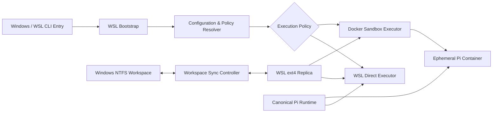

# Pix

## PROJECT OVERVIEW

Pix 是一个通过 NPM 分发的 Windows CLI 工具，用于将 Pi Coding Agent 的运行环境从宿主系统中解耦，并统一编排 Windows、WSL2 与 Docker Desktop 之间的执行链路。

## DESIGN MOTIVATION

Pi Coding Agent 通常需要读取项目文件、执行命令、安装依赖并修改代码。直接在 Windows 宿主环境运行 Agent，会使 Agent 获得较大的本地文件与进程访问范围；直接将 NTFS 项目目录挂载进 Docker，则会引入明显的小文件读写延迟。

Pix 将问题拆分为三个相互独立的部分：

* **宿主入口**：保留 Windows 下的低成本调用体验。
* **高性能工作区**：将项目投影到 WSL ext4 文件系统，避免 Agent 直接在 NTFS 上进行密集文件操作。
* **可控执行环境**：根据项目策略选择 WSL 直接执行或 Docker 容器执行。

## TECHNICAL PATH

### 01. Windows-to-WSL Bootstrap

当检测到命令运行在 Windows 环境时，CLI 会：

1. 识别目标 WSL2 Distribution。
2. 将 Windows 当前目录转换为对应的 WSL 路径。
3. 通过 `wsl.exe` 在目标 Linux 环境中重新启动 Pix。
4. 保留用户传入的 Pi 参数与当前工作目录。

### 02. Workspace Projection

当项目位于 Windows NTFS 分区时，Pix 不会直接将 `/mnt/c` 或 `/mnt/d` 下的目录作为 Agent 的主要工作区。系统根据源目录生成稳定的路径标识，并在 WSL ext4 文件系统中创建对应副本。

### 03. Mutagen Continuous Sync

为解决 Windows 编辑器与 WSL 工作副本之间的实时同步问题，Pix 使用 Mutagen 建立持续的双向同步会话。

同步会话支持：

* 双向安全同步
* 冲突自动决议
* 单向复制
* 会话暂停、保留或终止
* 项目级排除规则

### 04. Canonical Pi Runtime

Pix 在 WSL 文件系统中维护唯一的 Pi Runtime，用于持久化：

* 模型与 Provider 配置
* Authentication 信息
* Agent Sessions
* Prompts、Skills 与 Themes
* Extensions 配置

### 05. Dual Execution Policy

Pix 提供两种运行策略：Direct Mode 与 Sandbox Mode。

### 06. Configuration and Diagnostics

Pix 使用分层配置模型：

```text
CLI Flags
    ↓
Project .pix.json
    ↓
User ~/.pixrc.json
    ↓
Built-in Defaults
```

## ARCHITECTURE



## MODULE DESIGN

### HOST BRIDGE

负责 Windows 与 WSL2 之间的环境检测、路径转换和进程重启，将跨平台差异收敛到统一的 Linux 执行入口。

### WORKSPACE CONTROLLER

负责识别 NTFS 工作区、创建稳定的 ext4 投影路径、初始化项目副本以及管理 Mutagen 同步会话。

### RUNTIME MANAGER

维护唯一的 Pi Agent Runtime，使 Direct 与 Sandbox 模式共享配置、认证、会话和扩展状态。

### EXECUTION ROUTER

根据 CLI 参数、用户配置和项目配置选择 WSL Direct 或 Docker Sandbox 执行策略。

### SANDBOX ADAPTER

将工作区、Runtime、网络模式、文件权限和环境变量转换为 Docker 启动参数，并管理临时容器生命周期。

### DIAGNOSTIC LAYER

在启动前后检查 WSL、Docker、Pi、Mutagen、工作区存储位置以及 Runtime 挂载状态，降低跨环境问题的排查成本。

## ENGINEERING HIGHLIGHTS

* 桥接 Windows、WSL2 与 Docker 文件系统语义，同时不向用户暴露路径复杂性。
* Pi Runtime 状态需要在容器销毁和执行模式切换时保持连续。
* Mutagen 不可用时需优雅降级到 rsync/cp，避免同步组件故障阻断 Agent 启动。
* 通过项目级 `.pix.json` 安全地注入 API Key、代理和网络策略。

## PROJECT VALUE

Pix 将原本需要手动完成的 WSL 路径转换、Docker 镜像构建、目录挂载、环境变量注入、Runtime 管理和项目同步封装为单一 CLI 工作流。

项目并非单纯“将 Agent 放入容器”，而是围绕 Agent 执行过程建立了一层轻量级 Harness：

```text
Environment Detection
→ Workspace Preparation
→ Policy Resolution
→ Runtime Injection
→ Controlled Execution
→ Sync Cleanup
```

其目标是在不破坏本地开发体验的前提下，为具备代码执行能力的 Agent 提供更明确、可配置且可诊断的运行边界。
